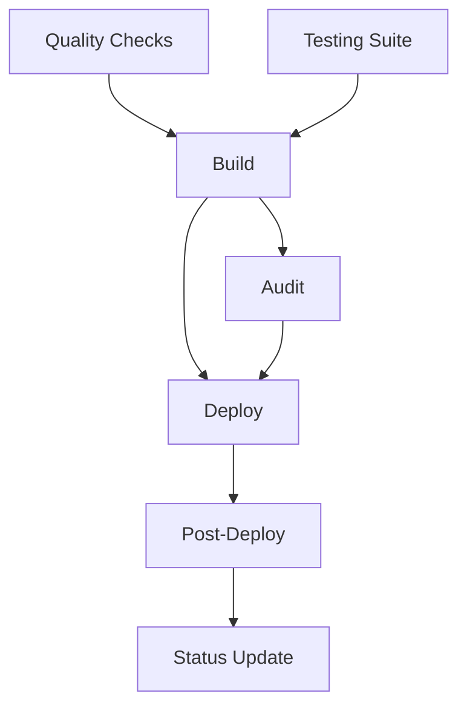
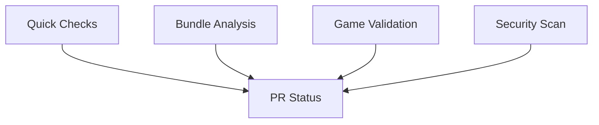

# GitHub Actions CI/CD Pipeline Guide

## Overview

This document describes the comprehensive GitHub Actions CI/CD pipeline for the Open Runner project, designed for automatic deployment to GitHub Pages with modern TypeScript, Vite, and Three.js stack.

## Pipeline Architecture

### Main Workflow: `deploy.yml`

The main deployment pipeline consists of 6 parallel jobs with dependencies:



### PR Workflow: `pr-checks.yml`

Pull request validation with fast feedback:



## Job Details

### 1. Quality Checks (`quality-checks`)

**Purpose**: Code quality and security validation
**Duration**: ~2-3 minutes
**Runs on**: `ubuntu-latest`

**Steps**:
- Dependency vulnerability scanning with `npm audit`
- ESLint code quality checks
- Prettier format verification
- TypeScript strict mode compilation

**Key Features**:
- Fails fast on security vulnerabilities
- Zero-tolerance for linting errors
- Strict TypeScript compilation

### 2. Testing Suite (`test`)

**Purpose**: Comprehensive testing with matrix strategy
**Duration**: ~5-8 minutes
**Runs on**: `ubuntu-latest`
**Strategy**: Matrix across test types (unit, integration, performance)

**Steps**:
- Virtual display setup for WebGL testing
- Vitest execution with WebGL mocking
- Coverage reporting (unit tests only)
- Performance benchmarking

**Key Features**:
- WebGL context mocking for Three.js
- Parallel test execution
- Comprehensive coverage reporting
- Performance regression detection

### 3. Build & Optimize (`build`)

**Purpose**: Production build with optimization
**Duration**: ~3-5 minutes
**Runs on**: `ubuntu-latest`

**Steps**:
- Vite production build
- Bundle size analysis
- Asset compression (Gzip + Brotli)
- Build artifact generation

**Key Features**:
- 5MB bundle size limit enforcement
- Tree shaking optimization
- Asset compression
- GitHub Pages base path configuration

**Outputs**:
- `build-size`: Human-readable build size
- `bundle-analysis`: Analysis report status

### 4. Security & Performance Audit (`audit`)

**Purpose**: Production build validation
**Duration**: ~4-6 minutes
**Runs on**: `ubuntu-latest`

**Steps**:
- Lighthouse CI performance audit
- Security vulnerability assessment
- Performance metrics validation

**Key Features**:
- Core Web Vitals monitoring
- Accessibility compliance
- Performance budget enforcement
- Security best practices validation

### 5. Deploy to GitHub Pages (`deploy`)

**Purpose**: Production deployment
**Duration**: ~2-3 minutes
**Runs on**: `ubuntu-latest`
**Condition**: Main branch push only

**Steps**:
- GitHub Pages configuration
- Artifact upload
- Deployment execution

**Key Features**:
- Automatic GitHub Pages deployment
- Environment-specific configuration
- Deployment URL output

### 6. Post-Deploy Monitoring (`post-deploy`)

**Purpose**: Deployment validation
**Duration**: ~1-2 minutes
**Runs on**: `ubuntu-latest`

**Steps**:
- Health check with retry logic
- Game functionality validation
- Performance verification

**Key Features**:
- Automatic rollback on failure
- Health check validation
- Monitoring integration

### 7. Status Update (`status-update`)

**Purpose**: Deployment summary and notifications
**Duration**: ~30 seconds
**Runs on**: `ubuntu-latest`

**Steps**:
- Deployment summary generation
- PR comment creation
- Status reporting

**Key Features**:
- Rich deployment summaries
- Automatic PR comments
- Performance metrics reporting

## Configuration Files

### Package.json Scripts

```json
{
  "scripts": {
    "dev": "vite --host",
    "build": "npm run typecheck && vite build",
    "build:analyze": "npm run build && npx vite-bundle-analyzer dist/",
    "typecheck": "tsc --noEmit",
    "lint": "eslint src --ext .ts,.tsx --max-warnings 0",
    "format:check": "prettier --check \"src/**/*.{ts,tsx,css,md,json}\"",
    "test:unit": "vitest run --config vitest.config.unit.ts",
    "test:integration": "vitest run --config vitest.config.integration.ts",
    "test:performance": "vitest run --config vitest.config.performance.ts",
    "test:quick": "vitest run --config vitest.config.quick.ts"
  }
}
```

### Environment Variables

**GitHub Secrets Required**:
- `LHCI_GITHUB_APP_TOKEN`: Lighthouse CI integration (optional)

**Automatic Environment Variables**:
- `GITHUB_TOKEN`: Provided by GitHub Actions
- `GITHUB_REPOSITORY`: Repository name for base path
- `CI`: Set to `true` for CI environment detection

## Performance Targets

### Build Performance
- **Bundle Size**: <5MB total (enforced)
- **Build Time**: <5 minutes total pipeline
- **Asset Optimization**: Gzip + Brotli compression

### Runtime Performance
- **First Contentful Paint**: <2s
- **Largest Contentful Paint**: <3s
- **Time to Interactive**: <4s
- **Cumulative Layout Shift**: <0.1

### Testing Performance
- **Unit Tests**: <30s execution
- **Integration Tests**: <2 minutes
- **Performance Tests**: <3 minutes

## Security Measures

### Dependency Security
- Automated `npm audit` with high-level threshold
- Regular dependency updates via Dependabot
- Vulnerability scanning in CI/CD

### Code Security
- CodeQL static analysis
- ESLint security rules
- TypeScript strict mode

### Deployment Security
- GitHub Pages HTTPS enforcement
- Content Security Policy headers
- No secrets in client-side code

## Optimization Features

### Caching Strategy
- Node.js dependency caching
- Build artifact caching
- Asset compression caching

### Parallel Execution
- Matrix testing strategy
- Concurrent job execution
- Optimized resource usage

### Fast Feedback
- Quick validation on PRs
- Incremental builds
- Early failure detection

## Monitoring & Alerting

### Performance Monitoring
- Lighthouse CI integration
- Core Web Vitals tracking
- Bundle size regression detection

### Error Tracking
- Build failure notifications
- Test failure reports
- Deployment status updates

### Metrics Collection
- Build time tracking
- Test execution metrics
- Deployment frequency

## Troubleshooting

### Common Issues

**Build Failures**:
1. Check TypeScript compilation errors
2. Verify ESLint rule compliance
3. Confirm bundle size limits
4. Review dependency vulnerabilities

**Test Failures**:
1. WebGL context mocking issues
2. Async test timeouts
3. Performance regression
4. Integration test environment

**Deployment Issues**:
1. GitHub Pages configuration
2. Base path settings
3. Asset path resolution
4. CNAME conflicts

### Debug Commands

```bash
# Local testing
npm run test:unit -- --reporter=verbose
npm run build:analyze
npm run lint -- --debug

# CI debugging
# Add this to workflow for debugging:
- name: Debug CI Environment
  run: |
    echo "Node version: $(node --version)"
    echo "NPM version: $(npm --version)"
    echo "Build environment: $NODE_ENV"
    echo "Repository: $GITHUB_REPOSITORY"
    ls -la dist/
```

## Best Practices

### Development Workflow
1. Run `npm run test:quick` before commits
2. Use `npm run format` for consistent formatting
3. Follow conventional commit messages
4. Keep PR scope focused and small

### Performance Optimization
1. Monitor bundle size in PRs
2. Use lazy loading for non-critical features
3. Optimize assets (images, models, audio)
4. Implement progressive loading

### Security Best Practices
1. Regular dependency updates
2. No hardcoded secrets
3. Validate all user inputs
4. Use TypeScript strict mode

## Future Enhancements

### Planned Features
- Visual regression testing
- Cross-browser testing matrix
- Automatic performance budgets
- Advanced monitoring integration

### Infrastructure Improvements
- CDN integration for assets
- Progressive Web App optimizations
- Service worker caching strategies
- Performance analytics integration

## Support & Documentation

- **CI/CD Issues**: Check GitHub Actions logs
- **Build Problems**: Review Vite configuration
- **Test Issues**: Examine Vitest configuration
- **Performance**: Analyze Lighthouse reports

For additional support, review the main project documentation and GitHub Actions workflow files.