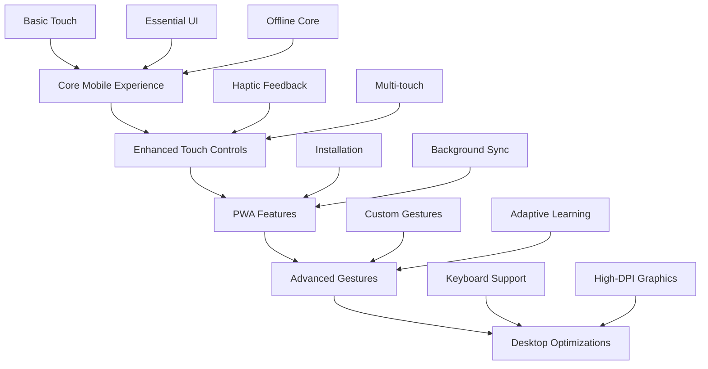
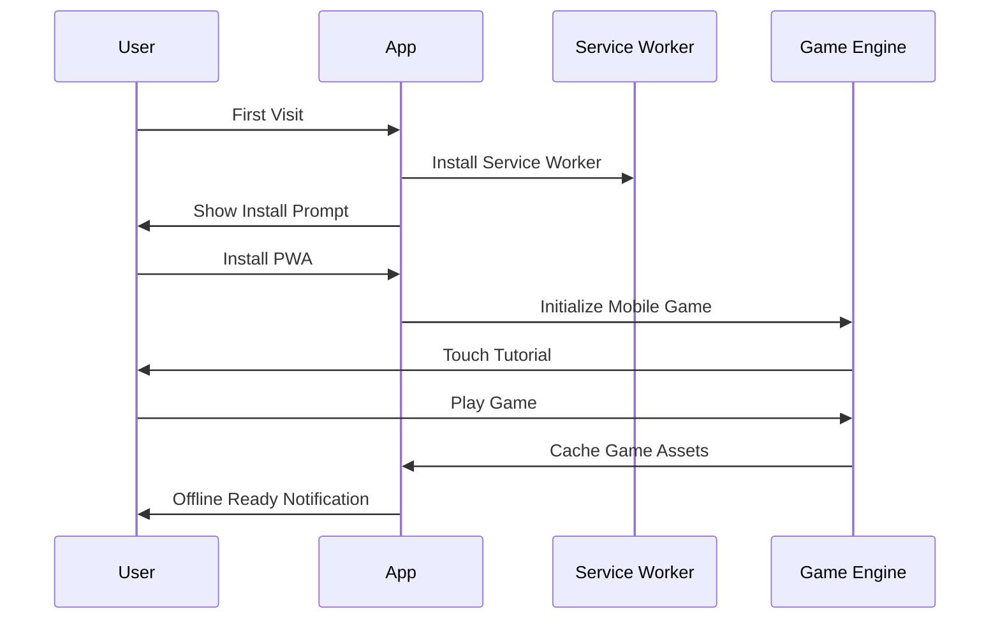
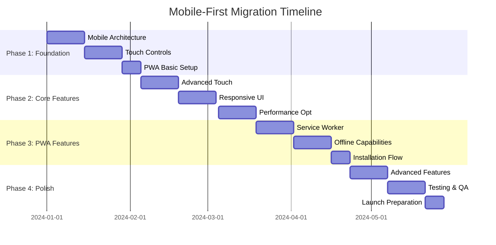

# Mobile-First Development Strategy for Open Runner

## 🎯 Executive Summary

This comprehensive mobile-first development strategy outlines the transformation of Open Runner from a desktop-centric 3D endless runner into a modern, mobile-optimized Progressive Web App that delivers native-quality gaming experiences across all devices.

### Current State Assessment
- **Mobile Readiness Score**: 6.5/10
- **Codebase Size**: ~14,519 lines across 60+ JavaScript files
- **Current Mobile Features**: Basic touch controls, rudimentary responsive design
- **Performance**: Advanced performance management system in place
- **Architecture**: Well-structured but desktop-first design

### Target Mobile Experience
- **Performance**: 60fps on mid-range devices, <2.5s load time
- **Controls**: Gesture-driven, haptic-enabled touch interface
- **Offline**: Full gameplay available without internet
- **Installation**: One-tap PWA installation with native app feel
- **Accessibility**: WCAG AA compliant, screen reader compatible

## 🏗️ Architectural Transformation Strategy

### 1. Mobile-First Architecture Principles

#### Core Design Philosophy
```javascript
// Mobile-First Architecture Pattern
class MobileFirstGameArchitecture {
  constructor() {
    this.designPrinciples = {
      // Performance First
      performance: 'Optimize for mobile hardware constraints',
      
      // Touch First  
      interaction: 'Design for fingers, not mouse cursors',
      
      // Network Aware
      connectivity: 'Assume slow, unreliable connections',
      
      // Battery Conscious
      power: 'Minimize battery drain through smart optimizations',
      
      // Progressive Enhancement
      enhancement: 'Start mobile, enhance for larger screens'
    };
  }
}
```

#### Responsive-First Component Design
```css
/* Mobile-First CSS Methodology */
.game-component {
  /* Mobile base styles (320px+) */
  width: 100%;
  padding: var(--space-sm);
  font-size: var(--text-base);
}

/* Only enhance for larger screens */
@media (min-width: 768px) {
  .game-component {
    padding: var(--space-lg);
    font-size: var(--text-lg);
  }
}

@media (min-width: 1024px) {
  .game-component {
    max-width: 1200px;
    margin: 0 auto;
  }
}
```

### 2. Progressive Enhancement Strategy

#### Layer-Based Enhancement Model


#### Enhancement Implementation
```javascript
class ProgressiveEnhancement {
  constructor() {
    this.features = new Map([
      ['core', this.setupCoreExperience],
      ['touch-enhanced', this.setupEnhancedTouch],
      ['pwa', this.setupPWAFeatures],
      ['advanced-gestures', this.setupAdvancedGestures],
      ['desktop-optimized', this.setupDesktopOptimizations]
    ]);
    
    this.enableFeaturesByCapability();
  }
  
  enableFeaturesByCapability() {
    // Always start with core mobile experience
    this.features.get('core')();
    
    // Progressive enhancement based on capabilities
    if (this.hasTouch()) {
      this.features.get('touch-enhanced')();
    }
    
    if (this.supportsPWA()) {
      this.features.get('pwa')();
    }
    
    if (this.hasAdvancedTouch()) {
      this.features.get('advanced-gestures')();
    }
    
    if (this.isDesktopClass()) {
      this.features.get('desktop-optimized')();
    }
  }
}
```

## 🎮 User Experience Strategy

### 1. Mobile Gaming UX Principles

#### Touch-Native Interaction Design
**Gesture-First Controls:**
- **Primary Navigation**: Swipe gestures for movement
- **Secondary Actions**: Tap and hold for special abilities
- **Contextual Controls**: Adaptive UI based on game state
- **Feedback Systems**: Immediate haptic and visual feedback

#### Accessibility-First Design
**Inclusive Gaming Features:**
- **Motor Accessibility**: Large touch targets (minimum 44px)
- **Visual Accessibility**: High contrast mode, scalable UI
- **Cognitive Accessibility**: Simple, consistent interaction patterns
- **Auditory Accessibility**: Visual feedback for all audio cues

### 2. Mobile-Optimized User Journey

#### Onboarding Flow


#### Gameplay Experience Flow
1. **Instant Launch**: <3 seconds from tap to gameplay
2. **Intuitive Controls**: No tutorial required for basic play
3. **Progressive Disclosure**: Advanced features unlocked gradually
4. **Seamless Interruption**: Handle phone calls, notifications gracefully
5. **Quick Resume**: Return to exact game state after interruption

### 3. Performance-Perceived UX

#### Loading Experience Strategy
```javascript
class MobileLoadingExperience {
  constructor() {
    this.loadingStages = [
      { stage: 'app-shell', target: 500, priority: 'critical' },
      { stage: 'core-game', target: 1500, priority: 'high' },
      { stage: 'assets-essential', target: 2500, priority: 'medium' },
      { stage: 'assets-enhanced', target: 5000, priority: 'low' }
    ];
    
    this.setupProgressiveLoading();
  }
  
  setupProgressiveLoading() {
    // Show app shell immediately
    this.showAppShell();
    
    // Load and show game progressively
    this.loadGameCore()
      .then(() => this.enableBasicGameplay())
      .then(() => this.loadEssentialAssets())
      .then(() => this.enableFullGameplay())
      .then(() => this.loadEnhancedAssets())
      .then(() => this.enableEnhancedFeatures());
  }
}
```

## 📱 Technology Stack & Tools

### 1. Core Technology Decisions

#### Frontend Stack
```javascript
// Modern Mobile Web Stack
const technologyStack = {
  // Core Framework
  framework: 'Vanilla JS + Web Components', // For performance
  
  // Graphics & 3D
  graphics: 'Three.js with mobile optimizations',
  
  // State Management  
  state: 'Custom mobile-optimized state manager',
  
  // Styling
  css: 'Modern CSS with Container Queries',
  
  // Build System
  build: 'Webpack 5 with mobile-specific optimizations',
  
  // PWA Tools
  pwa: 'Workbox for service worker management',
  
  // Testing
  testing: 'Playwright for cross-device testing',
  
  // Performance
  monitoring: 'Web Vitals + custom mobile metrics'
};
```

#### Mobile-Specific Dependencies
```json
{
  "dependencies": {
    "three": "^0.163.0",
    "workbox-window": "^7.0.0",
    "idb": "^8.0.0"
  },
  "devDependencies": {
    "workbox-webpack-plugin": "^7.0.0",
    "webpack-pwa-manifest": "^4.3.0",
    "compression-webpack-plugin": "^10.0.0",
    "image-webpack-loader": "^8.1.0",
    "@playwright/test": "^1.40.0",
    "lighthouse-ci": "^0.12.0"
  }
}
```

### 2. Development Environment

#### Mobile-First Development Setup
```bash
# Development Environment Setup
npm create mobile-game-project@latest open-runner-mobile
cd open-runner-mobile

# Install mobile development tools
npm install -g @capacitor/cli
npm install -g lighthouse
npm install -g @storybook/cli

# Setup device testing
npx playwright install
npx @capacitor/cli add ios
npx @capacitor/cli add android

# Start mobile-first development
npm run dev:mobile
```

#### Testing Infrastructure
```javascript
// Mobile Testing Configuration
const mobileTestConfig = {
  // Device Testing Matrix
  devices: [
    'iPhone 12', 'iPhone 14 Pro', 'iPhone SE',
    'Samsung Galaxy S21', 'Google Pixel 6',
    'iPad Air', 'Samsung Galaxy Tab S8'
  ],
  
  // Performance Thresholds
  performance: {
    LCP: 2500,      // Largest Contentful Paint
    FID: 100,       // First Input Delay  
    CLS: 0.1,       // Cumulative Layout Shift
    FPS: 60,        // Frame Rate
    Memory: 150     // Memory Usage (MB)
  },
  
  // Accessibility Requirements
  accessibility: {
    score: 95,      // Lighthouse A11y Score
    wcag: 'AA',     // WCAG Compliance Level
    colorContrast: 4.5, // Minimum Contrast Ratio
    touchTargetSize: 44  // Minimum Touch Target (px)
  }
};
```

## 🚀 Implementation Strategy

### 1. Migration Approach

#### Incremental Migration Path


#### Code Migration Strategy
```javascript
// Gradual Component Migration
class MigrationManager {
  constructor() {
    this.migrationPlan = [
      { component: 'input-system', priority: 'critical', effort: 'high' },
      { component: 'ui-components', priority: 'high', effort: 'medium' },
      { component: 'performance-manager', priority: 'high', effort: 'low' },
      { component: 'game-loop', priority: 'medium', effort: 'medium' },
      { component: 'asset-loader', priority: 'medium', effort: 'high' }
    ];
  }
  
  executeMigration() {
    return this.migrationPlan
      .sort((a, b) => this.priorityScore(b) - this.priorityScore(a))
      .map(item => this.migrateComponent(item));
  }
  
  priorityScore(item) {
    const priorityWeights = { critical: 10, high: 7, medium: 4, low: 1 };
    const effortWeights = { low: 3, medium: 2, high: 1 };
    
    return priorityWeights[item.priority] * effortWeights[item.effort];
  }
}
```

### 2. Risk Mitigation

#### Technical Risk Management
```javascript
const riskMitigation = {
  // Performance Risks
  performance: {
    risk: 'Frame rate drops on low-end devices',
    mitigation: 'Adaptive quality system with aggressive fallbacks',
    monitoring: 'Real-time FPS tracking with auto-adjustment'
  },
  
  // Compatibility Risks  
  compatibility: {
    risk: 'Feature support varies across mobile browsers',
    mitigation: 'Progressive enhancement with polyfills',
    monitoring: 'Feature detection and graceful degradation'
  },
  
  // User Experience Risks
  ux: {
    risk: 'Touch controls feel unresponsive or inaccurate',
    mitigation: 'Extensive user testing and gesture customization',
    monitoring: 'Touch latency metrics and user feedback'
  },
  
  // Business Risks
  business: {
    risk: 'Development timeline extends beyond estimates',
    mitigation: 'Phased delivery with MVP in Phase 1',
    monitoring: 'Weekly milestone reviews and scope adjustment'
  }
};
```

## 📊 Success Metrics & KPIs

### 1. Technical Performance Metrics

#### Core Web Vitals Targets
```javascript
const performanceTargets = {
  // Core Web Vitals
  LCP: { target: 2500, good: '<2.5s', poor: '>4.0s' },
  FID: { target: 100, good: '<100ms', poor: '>300ms' },
  CLS: { target: 0.1, good: '<0.1', poor: '>0.25' },
  
  // Mobile-Specific Metrics
  touchLatency: { target: 16, good: '<16ms', poor: '>50ms' },
  gestureAccuracy: { target: 95, good: '>95%', poor: '<85%' },
  batteryEfficiency: { target: 15, good: '<15%/hr', poor: '>25%/hr' },
  
  // Game-Specific Metrics
  frameRate: { target: 60, good: '60fps', poor: '<30fps' },
  loadTime: { target: 3000, good: '<3s', poor: '>5s' },
  memoryUsage: { target: 150, good: '<150MB', poor: '>250MB' }
};
```

### 2. User Experience Metrics

#### UX Success Indicators
```javascript
const uxMetrics = {
  // Engagement Metrics
  sessionDuration: { target: 300, unit: 'seconds' },
  returnRate: { target: 60, unit: 'percentage' },
  installationRate: { target: 30, unit: 'percentage' },
  
  // Usability Metrics  
  timeToFirstPlay: { target: 10, unit: 'seconds' },
  gestureSuccessRate: { target: 95, unit: 'percentage' },
  tutorialCompletion: { target: 80, unit: 'percentage' },
  
  // Accessibility Metrics
  accessibilityScore: { target: 95, unit: 'lighthouse-score' },
  screenReaderSupport: { target: 100, unit: 'percentage' },
  colorContrastRatio: { target: 4.5, unit: 'ratio' }
};
```

### 3. Business Impact Metrics

#### ROI & Business Value
```javascript
const businessMetrics = {
  // User Acquisition
  organicInstalls: { baseline: 0, target: 1000, unit: 'monthly' },
  shareRate: { baseline: 2, target: 15, unit: 'percentage' },
  viralCoefficient: { baseline: 0.1, target: 0.3, unit: 'ratio' },
  
  // User Retention
  day1Retention: { baseline: 30, target: 60, unit: 'percentage' },
  day7Retention: { baseline: 15, target: 35, unit: 'percentage' },
  day30Retention: { baseline: 5, target: 20, unit: 'percentage' },
  
  // Technical Excellence
  bugReports: { baseline: 50, target: 10, unit: 'monthly' },
  performanceIssues: { baseline: 25, target: 5, unit: 'monthly' },
  supportTickets: { baseline: 30, target: 8, unit: 'monthly' }
};
```

## 🎯 Launch Strategy

### 1. Soft Launch Plan

#### Beta Testing Program
```javascript
const betaTestingPlan = {
  // Phase 1: Internal Testing (2 weeks)
  internal: {
    participants: 'Development team + stakeholders',
    focus: 'Core functionality and major bugs',
    devices: 'Primary development devices',
    feedback: 'Direct communication and bug tracking'
  },
  
  // Phase 2: Closed Beta (3 weeks)
  closedBeta: {
    participants: '50 selected users across device types',
    focus: 'User experience and device compatibility',
    devices: 'Diverse mobile device matrix',
    feedback: 'In-app feedback system and analytics'
  },
  
  // Phase 3: Open Beta (4 weeks)
  openBeta: {
    participants: '500+ public beta testers',
    focus: 'Performance at scale and edge cases',
    devices: 'All supported devices',
    feedback: 'Community feedback and crash reporting'
  }
};
```

### 2. Marketing & Distribution

#### PWA Distribution Strategy
```javascript
const distributionStrategy = {
  // Primary Channels
  pwa: {
    method: 'Direct web installation',
    audience: 'Mobile web users',
    conversion: 'Install prompts and onboarding',
    tracking: 'Installation analytics and user flow'
  },
  
  // Secondary Channels
  social: {
    method: 'Social media sharing',
    audience: 'Gaming communities',
    conversion: 'Viral sharing mechanics',
    tracking: 'Share rate and referral tracking'
  },
  
  // App Store Presence
  stores: {
    method: 'TWA (Trusted Web Activity) on Play Store',
    audience: 'Traditional app store users',
    conversion: 'App store optimization',
    tracking: 'Store analytics and conversion rates'
  }
};
```

## 🔮 Future Roadmap

### 1. Post-Launch Enhancements

#### Advanced Features Pipeline
```javascript
const futureFeatures = {
  // Q1 Post-Launch
  q1: [
    'Multiplayer racing modes',
    'Advanced gesture customization',
    'Social leaderboards integration',
    'AR mode experiments'
  ],
  
  // Q2 Post-Launch  
  q2: [
    'Machine learning-powered adaptive difficulty',
    'Voice control integration',
    'Advanced haptic patterns',
    'Cross-platform progress sync'
  ],
  
  // Q3 Post-Launch
  q3: [
    'VR mode for compatible devices',
    'AI-generated level content',
    'Advanced accessibility features',
    'Platform-specific optimizations'
  ]
};
```

### 2. Technology Evolution

#### Emerging Technology Integration
```javascript
const technologyRoadmap = {
  // Web Platform Evolution
  webPlatform: [
    'WebAssembly integration for performance',
    'WebGPU adoption for advanced graphics',
    'Web Bluetooth for controller support',
    'WebXR for immersive experiences'
  ],
  
  // Mobile Platform Features
  mobilePlatform: [
    'Dynamic Island integration (iOS)',
    'Material You theming (Android)',
    'Shortcuts and widgets support',
    'Native app store features'
  ],
  
  // Performance Technologies
  performance: [
    'HTTP/3 and QUIC protocol adoption',
    'Advanced compression algorithms',
    'Edge computing integration',
    'AI-powered optimization'
  ]
};
```

This comprehensive mobile-first development strategy provides a clear path to transform Open Runner into a world-class mobile gaming experience that meets the highest standards of modern web development while delivering exceptional user experiences across all mobile devices.